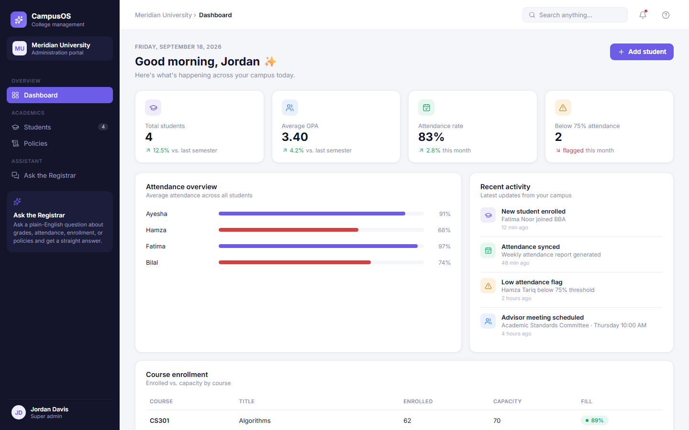
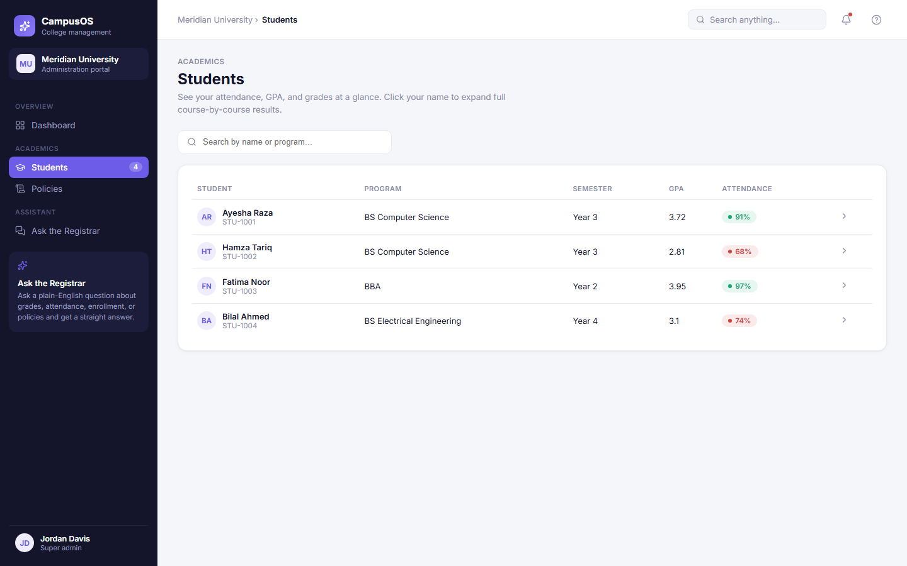
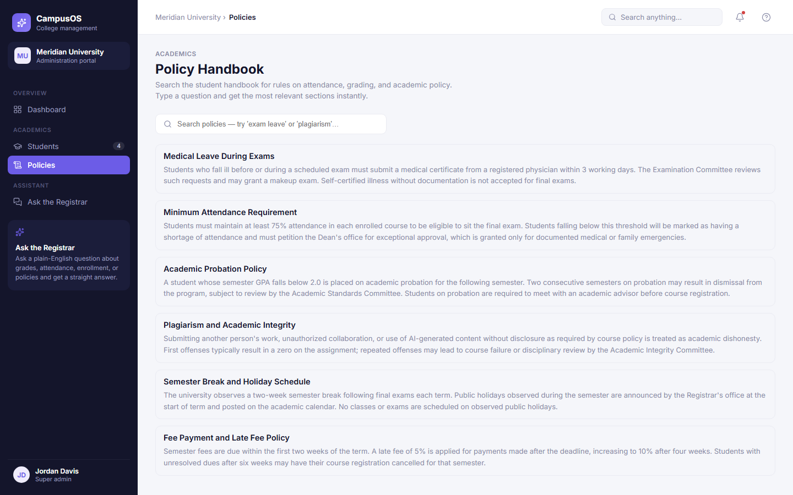
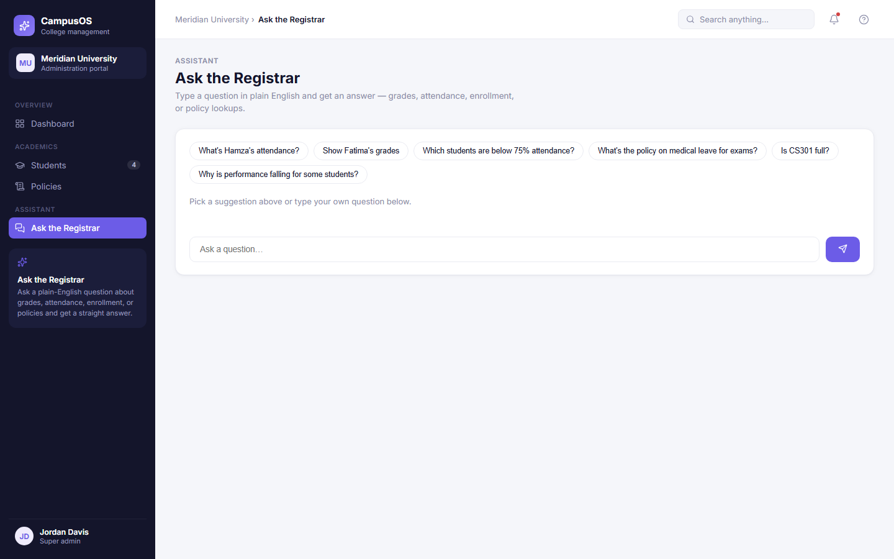

# AI-Supported College CMS

A college campus management dashboard with a natural-language assistant, built to demonstrate a real **Model Context Protocol (MCP)** integration and **Retrieval-Augmented Generation (RAG)** pipeline — not mocked or simulated versions of either.

> Ask questions like *"What's Hamza's attendance?"* or *"What's the policy on medical leave for exams?"* in plain English. Gemini decides which tool to call, the call travels over MCP's JSON-RPC transport to a real MCP server, and the answer comes back rendered as native UI (badges, bars, cards) instead of a wall of text.

## Screenshots

| Dashboard | Students |
|---|---|
|  |  |

| Policy Handbook (semantic search) | Ask the Registrar (MCP + Gemini) |
|---|---|
|  |  |

## What this project demonstrates

Most "AI + tools" demos fake the interesting part: a big `if/else` or `switch` statement pretending to be tool use. This project wires up the actual protocols — built to show a few things that don't usually fit in a portfolio-sized project:

- **Reading a spec and implementing it for real.** [`api/mcp.js`](api/mcp.js) is a genuine `@modelcontextprotocol/sdk` server exposing six tools over MCP's Streamable HTTP transport (tool discovery via `tools/list`, schema-driven invocation via `tools/call`). [`api/ask.js`](api/ask.js) is a genuine MCP *client* connecting to it over the network — not a local function pointer dressed up as "tool use."
- **Wiring two systems that weren't designed for each other.** MCP's tool schemas are plain JSON Schema; Gemini's function-calling API wants its own `SchemaType` enum shape. [`toGeminiSchema()`](api/ask.js) converts one into the other at request time, so the tool list is generated from the MCP server instead of hand-duplicated.
- **RAG built from the ground up**, not a vector-DB SaaS: policies are embedded offline with Gemini's `gemini-embedding-001` model ([`scripts/embed-policies.mjs`](scripts/embed-policies.mjs)), then ranked at request time with a hand-rolled cosine-similarity search ([`api/lib/rag.js`](api/lib/rag.js)) — one retrieval function reused by both the chat assistant and the handbook's own search bar, instead of forked logic.
- **Treating an LLM endpoint like the untrusted, costly resource it is** — a system prompt that scopes what the model will answer, a server-side-only API key, same-origin request guarding, and query-length caps, all because a public "ask AI anything" text box is an open invitation to abuse.
- **Full-stack ownership**: React 19 frontend, serverless API layer, third-party AI SDK integration, and a protocol-level integration, all in one small, readable codebase — deployed on Vercel with zero config.

## Features

- **Dashboard** — enrollment stats, attendance overview, and course capacity at a glance.
- **Students** — searchable roster with per-student attendance and grades.
- **Policy Handbook** — semantic search over the student handbook (leave, attendance, probation, plagiarism, fees, holidays).
- **Ask the Registrar** — a chat interface where Gemini autonomously chooses between six MCP tools (attendance, grades, low-attendance list, enrollment lookup, performance-trend analysis, and policy search) or falls back to a scoped text answer, refusing anything off-topic.
- Fully responsive layout, down to phone-sized viewports.

## How a query flows through the system

```
Browser (Ask.jsx)
   │  POST /api/ask { query }
   ▼
api/ask.js  ──MCP client (Streamable HTTP)──▶  api/mcp.js  ──MCP server──▶  tool handlers
   │                                                                        (src/lib/tools.js,
   │  Gemini picks a tool + args                                            api/lib/rag.js)
   ▼
Gemini (function calling)
   │  tool result
   ▼
Rendered as a badge / bar / card in the chat log
```

The Policy Handbook's search bar takes a shorter path straight to `api/search-policies.js`, which calls the same `searchPoliciesSemantic()` used by the `search_policy_docs` MCP tool — one retrieval implementation, two entry points.

## Tech stack

| Layer | Choice |
|---|---|
| Frontend | React 19, React Router, Vite |
| AI | Google Gemini (`gemini-flash-lite-latest` for chat, `gemini-embedding-001` for embeddings) |
| Tool protocol | Model Context Protocol (`@modelcontextprotocol/sdk`), Streamable HTTP, stateless mode |
| Validation | Zod (MCP tool input schemas) |
| Hosting | Vercel (serverless functions under `api/`) |
| Icons | lucide-react |

## Getting started

```bash
git clone https://github.com/FaranTech/ai-supported-cms.git
cd ai-supported-cms
npm install
```

Create a `.env` file with a [Gemini API key](https://aistudio.google.com/apikey):

```bash
cp .env.example .env
# then edit .env:
GEMINI_API_KEY=your-key-here
```

Generate the policy embeddings once (only needed the first time, or after editing `src/data/policies.js`):

```bash
npm run embed:policies
```

Run the dev server (a Vite plugin shims the `api/` serverless functions locally, so `vercel dev` isn't needed):

```bash
npm run dev
```

Other scripts:

```bash
npm run build     # production build
npm run preview   # preview the production build locally
npm run lint       # oxlint
```

## Project structure

```
api/
  ask.js              # MCP client + Gemini function-calling orchestration
  mcp.js               # MCP server exposing the registrar's tools
  search-policies.js   # RAG endpoint for the Policy Handbook search bar
  lib/
    rag.js             # Embedding + cosine-similarity retrieval
    guard.js           # Same-origin check + query validation
scripts/
  embed-policies.mjs   # One-off script: embeds policies.js into policy-embeddings.js
src/
  pages/               # Dashboard, Students, Policies, Ask
  components/          # Sidebar, Topbar
  data/                # Seed data (students, courses, policy text + embeddings)
  lib/tools.js          # Tool logic shared by the MCP server
```

## Deployment

Deploys to Vercel with zero configuration — push to a connected repo and set `GEMINI_API_KEY` in the project's environment variables. Each file under `api/` becomes its own serverless function automatically.

## Disclaimer

All student, course, and policy data is fictional demo content for illustration only.
